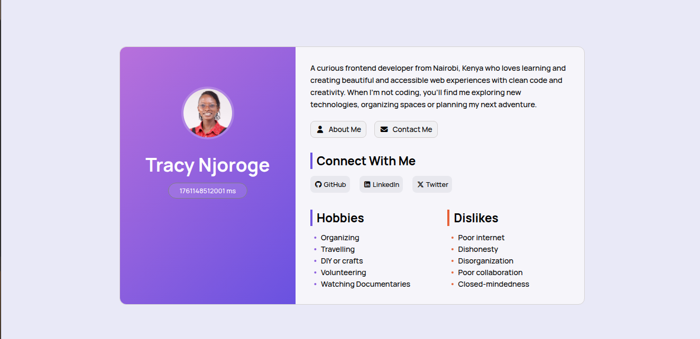
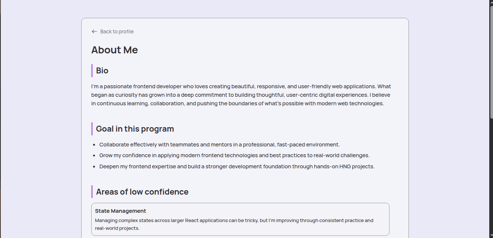
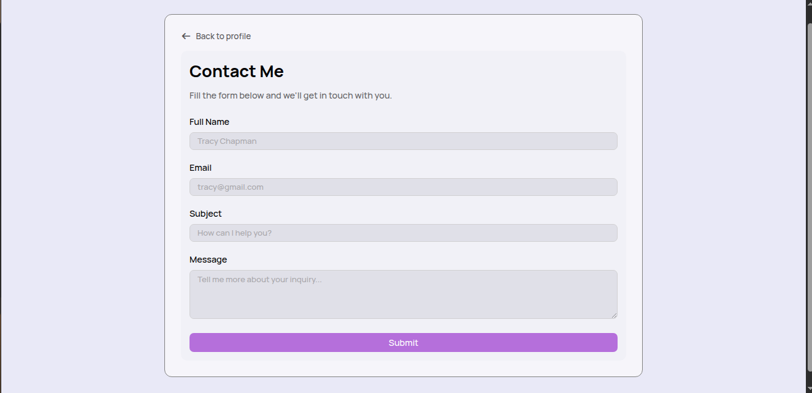

# HNG Stage 0 and Stage 1 - Profile Card Component
A responsive and accessible multi-page profile web application created with HTML, CSS, and vanilla JavaScript for the HNG13 Internship (Stage 0 & 1). Each page follows semantic HTML standards, supports keyboard navigation for improved accessibility, and adapts seamlessly across mobile, tablet, and desktop devices.

### Links

- GitHub Repository: [Repository](https://github.com/26TracyNjoroge/profile-card-stage0)
- Live Site URL: [Live Demo](https://profile-card-two-pearl.vercel.app/)

## Overview
This project consists of three main pages:
1. **Profile Card Component** - Displays personal details, time in milliseconds, and social links.
2. **About Me Page** - A reflective page with structured sections.
3. **Contact Us Page** - A fully accessible form with client-side validation and success messages.

## Features

- **Dynamic Time Display**: Real-time milliseconds counter using requestAnimationFrame for accurate updates.
- **Avatar Upload**: Upload custom avatar images or use a default URL.
- **Responsive Design**: Optimized for mobile, tablet, and desktop screens.
- **Semantic HTML**: Uses proper HTML5 semantic elements for better accessibility.
- **Accessible**: Includes alt text, ARIA labels, keyboard navigation, and focus styles.
- **Social Links**: Connected to GitHub, LinkedIn, and Twitter profiles.
- **Contact Me Page**: Includes form validation and accessibility support.
- **About Me Page**: A reflective section following proper semantic structure.


## Project Structure
```
profile-card-stage0/
├── index.html    
├── about.html
├── contact.html    
├── css/
│   └── styles.css      
├── src/
│   ├── app.js 
│   └── form.js       
├── assets/
│   ├── images/
│   │   └── avatar.jpg 
│   └── fonts/
│       ├── manrope-v20-latin-500.woff2
│       └── manrope-v20-latin-700.woff2
├── screenshots/ 
|       ├── about-page1-desktop.png
|       ├── about-page2-desktop.png
|       ├── contact-page-desktop.png
│       └── profile-card-desktop.png
└── README.md           
```

## Technologies Used

- HTML5
- CSS3 (Flexbox)
- Vanilla JavaScript
- Font Awesome 
- Manrope Font


## How to Run Locally
1. Clone the repository
```bash
   git clone git@github.com:26TracyNjoroge/profile-card-stage0.git
```
2. Open `index.html` in your browser
3. Navigate to `contact.html` and `about.html` to view the pages.

## Testing & Validation

### Data-testid Attributes

All required `data-testid` attributes are present:

#### Profile Card Page
- `test-profile-card`
- `test-user-avatar`
- `test-user-name`
- `test-user-bio`
- `test-user-time`
- `test-user-social-links`
- `test-user-social-github`
- `test-user-social-linkedin`
- `test-user-social-x`
- `test-user-hobbies`
- `test-user-dislikes`

#### Contact Us Page
- `test-contact-name`
- `test-contact-email`
- `test-contact-subject`
- `test-contact-message`
- `test-contact-submit`
- `test-contact-error-<field>`(eg.,`test-contact-error-email`)
- `test-contact-success`

#### About Me Page
- `test-about-bio`
- `test-about-goals`
- `test-about-confidence`
- `test-about-future-note`
- `test-about-extra`


### Manual Testing Checklist

- **Page Load:** Avatar displays with default image on initial load  
- **Avatar Upload:** Can click avatar and upload new image; displays immediately  
- **Time Display:** Milliseconds update continuously and match Date.now()  
- **Social Links:** All links open in new tabs
- **Responsive Layout:** Layout adapts correctly at mobile, tablet, and desktop breakpoints  
- **Keyboard Navigation:** All interactive elements are keyboard-focusable (Tab key)  
- **Focus Styles:** Visible outline appears when focused on interactive elements  
- **Hover Effects:** Avatar scaling and hover text (“Click to change avatar”) work  
- **Alt Text:** Avatar has descriptive alt attribute  
- **Accessibility:** Page works with screen readers; semantic markup present  

## Screenshots





## What I Learnt
- Gained experience handling both file uploads and URLs, converting files to blob URLs for display.  
- Improved accessibility by ensuring interactive elements are keyboard-focusable and have clear, visible focus outlines.
- Creating accessible forms with labels, error messages, and ARIA attributes.
- Implementing client-side validation and feedback mechanisms.


## Author

**Tracy Njoroge** - [GitHub](https://github.com/26TracyNjoroge) | [LinkedIn](https://www.linkedin.com/in/tracynjoroge/) | [Twitter](https://x.com/TracyNjoro90134)

---
